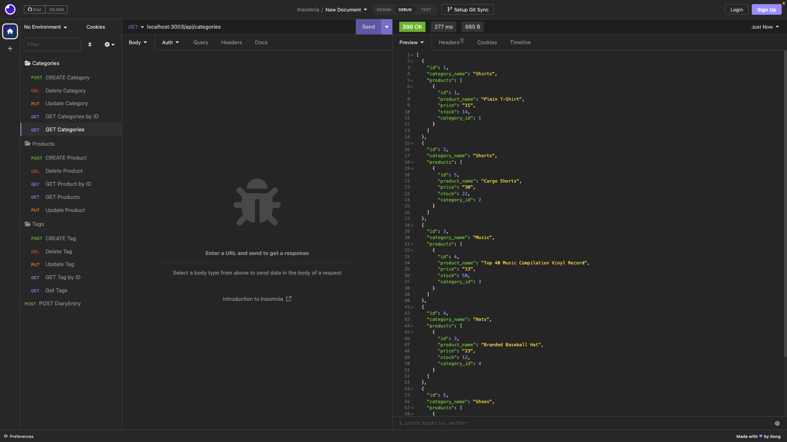
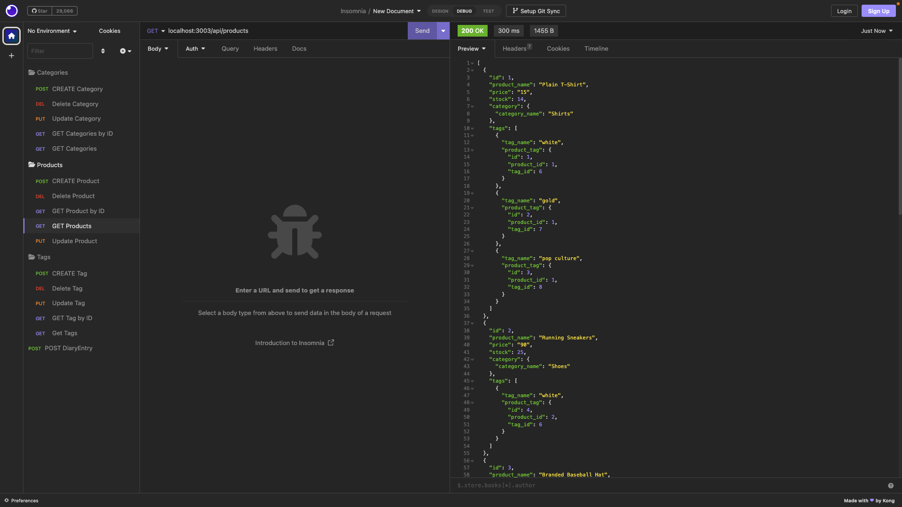
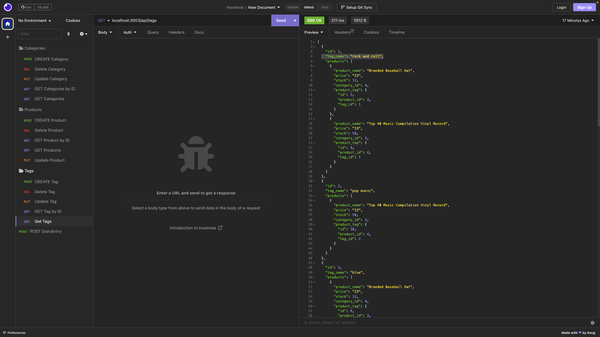

# E-Commerce_Back_End
E-Commerce_Back_End

## Description

- What was your motivation? My motivation behind building an E-Commerce_Back_End app is to create an app that can handle the orders of an ecommerce back end business.

- Why did you build this project? Building the E-Commerce_Back_End was driven by a desire to innovate and create something to handle the inventory of a online store. 
  
- What problem does it solve? It solves the issue of having a proper inventory and being able to keep track of the items that are available.
  
- What did you learn? Learned how to somewhat configure a backend solution.
  
## User Story
```
AS A manager at an internet retail company
I WANT a back end for my e-commerce website that uses the latest technologies
SO THAT my company can compete with other e-commerce companies
```

## Acceptance Criteria
```
GIVEN a functional Express.js API
WHEN I add my database name, MySQL username, and MySQL password to an environment variable file
THEN I am able to connect to a database using Sequelize
WHEN I enter schema and seed commands
THEN a development database is created and is seeded with test data
WHEN I enter the command to invoke the application
THEN my server is started and the Sequelize models are synced to the MySQL database
WHEN I open API GET routes in Insomnia for categories, products, or tags
THEN the data for each of these routes is displayed in a formatted JSON
WHEN I test API POST, PUT, and DELETE routes in Insomnia
THEN I am able to successfully create, update, and delete data in my database
```

## Table of Contents

- [E-Commerce\_Back\_End](#e-commerce_back_end)
  - [Description](#description)
  - [User Story](#user-story)
  - [Acceptance Criteria](#acceptance-criteria)
  - [Table of Contents](#table-of-contents)
  - [Usage](#usage)
  - [GitHub](#github)
  - [Youtube Videos](#youtube-videos)
  - [Sources](#sources)

## Usage

Can be used to keep track of online store inventory.







## GitHub
https://github.com/Kimberlyc1904/E-Commerce_Back_End

## Youtube Videos
```
https://youtu.be/XbVx13eafeU
https://youtu.be/EgnV9bm6K1A
https://youtu.be/L7dlnXUNDU8
https://youtu.be/J9d6DJ31Q0Y
```

## Sources
```
ChatGPT
W3 Schools
Github
Google
Stack Overflow
```
